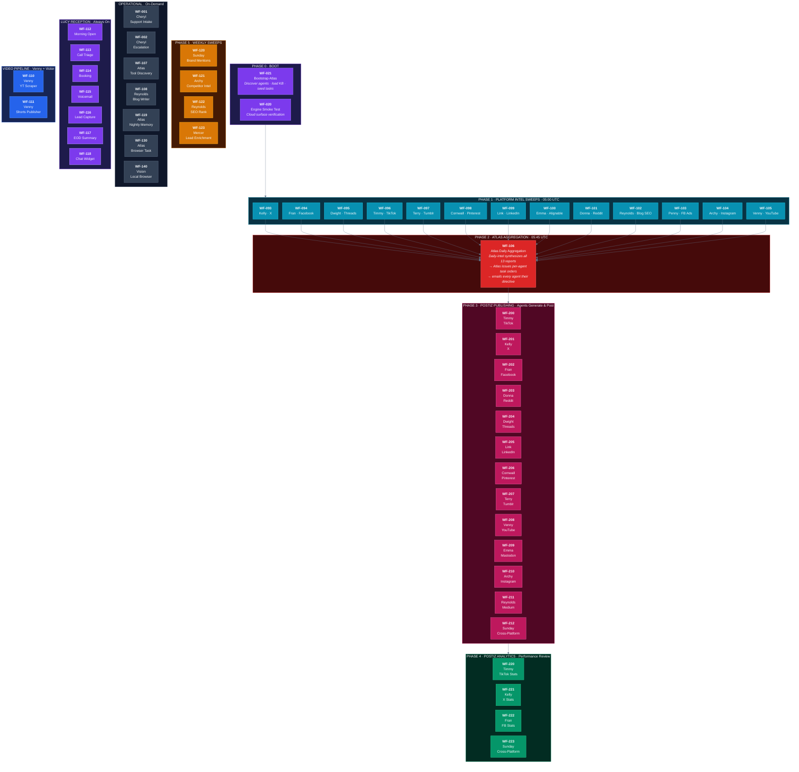

# Atlas UX Workflow Pipeline

> How work flows from Atlas down through intel → aggregation → publishing.



## Daily Cycle

| Time | Phase | Workflows | What Happens |
|------|-------|-----------|-------------|
| 05:00 UTC | **Intel Sweeps** | WF-093 → WF-105 | 13 agents each research their platform's trending topics via web search + LLM |
| 05:45 UTC | **Aggregation** | WF-106 | Daily-Intel synthesizes all 13 reports → Atlas reads unified packet → issues per-agent task orders → emails every agent |
| After 106 | **Publishing** | WF-200 → WF-212 | Each agent generates platform-specific content from intel + LLM → publishes via Postiz API |
| End of day | **Analytics** | WF-220 → WF-223 | Pull performance data from Postiz → 4-quadrant diagnostic (Scale / Fix CTA / Fix Hooks / Needs Work) |
| Nightly | **Memory** | WF-119 | Every agent logs a summary of their day to persistent memory |

## Publishing Pipeline Detail

```
Intel Sweep (WF-093–105)
    │
    ▼
Atlas Aggregation (WF-106)
    │  ┌─ Unified Intelligence Packet (Daily-Intel)
    │  └─ Per-Agent Task Orders (Atlas)
    ▼
Agent Content Generation
    │  1. Pull today's intel from audit log
    │  2. Pull Atlas task orders from WF-106
    │  3. Grab fresh web trends
    │  4. LLM drafts platform-specific content
    ▼
Postiz API Publish (WF-200–212)
    │  One API → 31 platforms
    │  No per-platform API approvals needed
    ▼
Analytics & Diagnostic (WF-220–223)
    │  Views × Engagement → 4-quadrant framework
    │  SCALE / FIX CTA / FIX HOOKS / NEEDS WORK
    ▼
Email Report to Atlas
```

## Workflow Count by Category

| Category | IDs | Count |
|----------|-----|-------|
| Boot | WF-020, WF-021 | 2 |
| Platform Intel | WF-093 → WF-105 | 13 |
| Aggregation | WF-106 | 1 |
| Tool Discovery | WF-107 | 1 |
| Content & Blog | WF-108 | 1 |
| Video Pipeline | WF-110, WF-111 | 2 |
| Lucy Reception | WF-112 → WF-118 | 7 |
| Nightly/Weekly | WF-119 → WF-123 | 5 |
| Browser/Vision | WF-130, WF-131, WF-140 | 3 |
| Postiz Publish | WF-200 → WF-212 | 13 |
| Postiz Analytics | WF-220 → WF-223 | 4 |
| Support | WF-001, WF-002, WF-010 | 3 |
| **Total** | | **56** |
