# Atlas UX Comprehensive Workflow Diagram

> Generated from source: `backend/src/agents/registry.ts`, `backend/src/workflows/registry.ts`,
> `backend/src/workers/schedulerWorker.ts`, `backend/src/core/engine/engine.ts`,
> `backend/src/core/exec/atlasGate.ts`, `backend/src/core/sgl.ts`,
> `policies/SGL.md`, `policies/EXECUTION_CONSTITUTION.md`

---

## 1. Full Agent Hierarchy (34 agents, 5 tiers)

```mermaid
graph TD
    classDef board fill:#7c3aed,stroke:#5b21b6,color:#fff,stroke-width:3px
    classDef exec fill:#2563eb,stroke:#1d4ed8,color:#fff,stroke-width:2px
    classDef gov fill:#0891b2,stroke:#0e7490,color:#fff,stroke-width:2px
    classDef spec fill:#059669,stroke:#047857,color:#fff,stroke-width:2px
    classDef sub fill:#6b7280,stroke:#4b5563,color:#fff,stroke-width:1px

    CHAIRMAN["CHAIRMAN<br/>Chairman of the Board<br/><i>Board Tier</i><br/>Final human authority"]:::board

    ATLAS["ATLAS<br/>President - Sole Execution Layer<br/><i>Executive Tier</i><br/>deepMode: ON"]:::exec

    CHAIRMAN --> ATLAS

    %% ── Executives (report to Atlas) ──────────────────────
    BINKY["BINKY<br/>Chief Research Officer<br/><i>Executive Tier</i><br/>deepMode: ON"]:::exec
    CHERYL["CHERYL<br/>Customer Support Specialist<br/><i>Executive Tier</i><br/>deepMode: ON<br/>Reports to: Binky"]:::exec

    ATLAS --> BINKY
    BINKY --> CHERYL

    %% ── Governors (report to Atlas) ──────────────────────
    TINA["TINA<br/>CFO<br/><i>Governor Tier</i><br/>deepMode: ON"]:::gov
    LARRY["LARRY<br/>Corporate Secretary<br/>Audit & Forensics<br/><i>Governor Tier</i><br/>deepMode: ON"]:::gov

    ATLAS --> TINA
    ATLAS --> LARRY

    %% ── Specialists (report to Atlas) ──────────────────────
    JENNY["JENNY<br/>General Counsel<br/><i>Specialist Tier</i>"]:::spec
    BENNY["BENNY<br/>IP Counsel<br/><i>Specialist Tier</i>"]:::spec
    VISION["VISION<br/>Local Vision Agent<br/><i>Specialist Tier</i>"]:::spec

    ATLAS --> JENNY
    ATLAS --> BENNY
    ATLAS --> VISION

    %% ── Subagents reporting to Atlas ──────────────────────
    MERCER["MERCER<br/>Customer Acquisition<br/><i>Subagent</i><br/>deepMode: ON"]:::sub
    PETRA["PETRA<br/>Project Manager<br/><i>Subagent</i><br/>deepMode: ON"]:::sub
    LUCY["LUCY<br/>Receptionist<br/><i>Subagent</i><br/>deepMode: OFF"]:::sub

    ATLAS --> MERCER
    ATLAS --> PETRA
    ATLAS --> LUCY

    %% ── Subagents reporting to Binky ──────────────────────
    DAILY_INTEL["DAILY-INTEL<br/>Intel Aggregator<br/><i>Subagent</i>"]:::sub
    ARCHY["ARCHY<br/>Research Subagent<br/><i>Subagent</i>"]:::sub
    SUNDAY["SUNDAY<br/>Comms & Doc Writer<br/><i>Subagent</i><br/>deepMode: ON"]:::sub
    FRANK["FRANK<br/>Forms & Data<br/><i>Subagent</i>"]:::sub

    BINKY --> DAILY_INTEL
    BINKY --> ARCHY
    BINKY --> SUNDAY
    BINKY --> FRANK

    %% ── Subagent reporting to Larry ──────────────────────
    PORTER["PORTER<br/>SharePoint Manager<br/><i>Subagent</i>"]:::sub
    LARRY --> PORTER

    %% ── Social media subagents reporting to Sunday ──────
    VENNY["VENNY<br/>Image Production<br/><i>Subagent</i>"]:::sub
    PENNY["PENNY<br/>Facebook Ads<br/><i>Subagent</i>"]:::sub
    DONNA["DONNA<br/>Reddit Manager<br/><i>Subagent</i>"]:::sub
    CORNWALL["CORNWALL<br/>Pinterest Agent<br/><i>Subagent</i>"]:::sub
    LINK["LINK<br/>LinkedIn Agent<br/><i>Subagent</i>"]:::sub
    DWIGHT["DWIGHT<br/>Threads Agent<br/><i>Subagent</i>"]:::sub
    REYNOLDS["REYNOLDS<br/>Blog Content<br/><i>Subagent</i>"]:::sub
    EMMA["EMMA<br/>Alignable Agent<br/><i>Subagent</i>"]:::sub
    FRAN["FRAN<br/>Facebook Page/Groups<br/><i>Subagent</i>"]:::sub
    KELLY["KELLY<br/>X (Twitter) Agent<br/><i>Subagent</i>"]:::sub
    TERRY["TERRY<br/>Tumblr Agent<br/><i>Subagent</i>"]:::sub
    TIMMY["TIMMY<br/>TikTok Agent<br/><i>Subagent</i>"]:::sub

    SUNDAY --> VENNY
    SUNDAY --> PENNY
    SUNDAY --> DONNA
    SUNDAY --> CORNWALL
    SUNDAY --> LINK
    SUNDAY --> DWIGHT
    SUNDAY --> REYNOLDS
    SUNDAY --> EMMA
    SUNDAY --> FRAN
    SUNDAY --> KELLY
    SUNDAY --> TERRY
    SUNDAY --> TIMMY

    %% ── Subagents reporting to Venny ──────────────────────
    VICTOR["VICTOR<br/>Video Production<br/><i>Subagent</i>"]:::sub
    VENNY --> VICTOR

    %% ── Subagents reporting to Emma ──────────────────────
    CLAIRE["CLAIRE<br/>Calendar Coordinator<br/><i>Subagent</i>"]:::sub
    SANDY["SANDY<br/>Bookings Agent<br/><i>Subagent</i>"]:::sub
    EMMA --> CLAIRE
    EMMA --> SANDY
```

---

## 2. Communication Channels per Agent

Every agent has a dedicated M365 mailbox (Outlook) and M365 Teams access. The matrix below shows which communication channels each agent uses and their permission level.

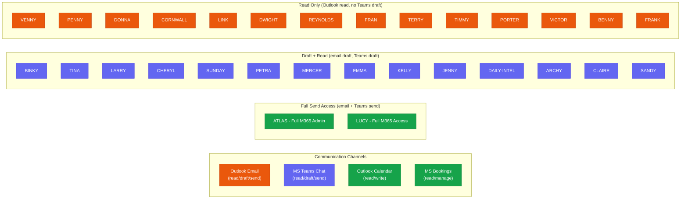

### Agent Communication Permission Summary

| Agent | Email | Teams Chat | Calendar | Bookings | Special |
|-------|-------|-----------|----------|----------|---------|
| **Chairman** | Read | Read | Read | - | Read-only dashboards |
| **Atlas** | Read/Draft/Send | Read/Draft/Send | Read/Write | Read/Manage | Full M365 Admin |
| **Lucy** | Read/Draft/Send | Read/Draft/Send | Read/Write | Read/Manage | Full M365 (Receptionist) |
| **Binky** | Read/Draft | Read/Draft | Read | - | Research tools |
| **Tina** | Read/Draft | Read (base) | Read | - | Excel write |
| **Larry** | Read/Draft | Read/Draft | - | - | SharePoint read |
| **Cheryl** | Read/Draft | Read/Draft | Read | Read | Bookings read |
| **Jenny** | Read/Draft | Read/Draft | - | - | Word write |
| **Benny** | Read/Draft | Read (base) | - | - | Word write |
| **Sunday** | Read/Draft | Read/Draft | - | - | Clipchamp, OneDrive write |
| **Petra** | Read/Draft | Read/Draft | Read | - | Planner read/write |
| **Mercer** | Read/Draft | Read/Draft | Read | Read | PowerPoint, Bookings |
| **Claire** | Read/Draft | Read/Draft + Meeting Create | Read/Write | Read | Teams meetings |
| **Sandy** | Read/Draft | Read/Draft | Read/Write | Read/Manage | Teams meeting read |
| **Emma** | Read/Draft | Read/Draft | Read | Read | OneDrive write |
| **Social Agents** | Read only | Read (base) | - | - | Content + OneDrive write |
| **Frank** | Read only | Read (base) | - | - | Forms create, Excel write |
| **Porter** | Read only | Read (base) | - | - | SharePoint write |
| **Victor** | Read only | Read (base) | - | - | Clipchamp write |
| **Vision** | - | - | - | - | Local browser + Claude Vision |

---

## 3. Complete Workflow Catalog (all WF-xxx IDs)

### Registered Workflow Catalog (workflowCatalog)

| WF ID | Workflow Name | Owner Agent | Description |
|-------|--------------|-------------|-------------|
| WF-001 | Support Intake (Cheryl) | cheryl | Create ticket, classify, acknowledge, route, audit |
| WF-002 | Support Escalation (Cheryl) | cheryl | Package escalation and route to executive owner |
| WF-010 | Daily Executive Brief (Binky) | binky | Daily intel digest with traceability |
| WF-020 | Engine Run Smoke Test (Atlas) | atlas | Minimal end-to-end cloud surface verification |
| WF-021 | Bootstrap Atlas (Atlas) | atlas | Boot, discover agents, load KB, seed tasks, queue boot email |
| WF-093 | Kelly X Platform Intel | kelly | X (Twitter) trending topics SERP + LLM report |
| WF-094 | Fran Facebook Platform Intel | fran | Facebook trending topics SERP + LLM report |
| WF-095 | Dwight Threads Platform Intel | dwight | Threads trending topics SERP + LLM report |
| WF-096 | Timmy TikTok Platform Intel | timmy | TikTok trending sounds/topics SERP + LLM report |
| WF-097 | Terry Tumblr Platform Intel | terry | Tumblr trending tags SERP + LLM report |
| WF-098 | Cornwall Pinterest Platform Intel | cornwall | Pinterest trending pins SERP + LLM report |
| WF-099 | Link LinkedIn Platform Intel | link | LinkedIn professional trends SERP + LLM report |
| WF-100 | Emma Alignable Platform Intel | emma | Alignable local business topics SERP + LLM report |
| WF-101 | Donna Reddit Platform Intel | donna | Reddit hot threads SERP + LLM report |
| WF-102 | Reynolds Blog SEO Intel | reynolds | Blog SEO trending topics SERP + LLM report |
| WF-103 | Penny Facebook Ads Intel | penny | Facebook Ads trending formats SERP + LLM report |
| WF-104 | Archy Instagram Intel | archy | Instagram Reels/hashtags SERP + LLM report |
| WF-105 | Venny YouTube Intel | venny | YouTube trending videos SERP + LLM report |
| WF-106 | Atlas Daily Aggregation & Task Assignment | atlas | Synthesize all 13 intel reports, assign tasks to all agents |
| WF-107 | Atlas Tool Discovery & Proposal | atlas | Agent gap analysis + SERP external tools + approve/deny links |
| WF-108 | Reynolds Blog Writer & Publisher | reynolds | SERP research, LLM draft, publish to KB, featured image |
| WF-110 | Venny YouTube Video Scraper & KB Ingest | venny | YouTube search, metadata + transcript, store in KB |
| WF-111 | Venny YouTube Shorts Auto-Publisher | venny | OneDrive download, YouTube Data API upload, audit trail |
| WF-112 | Lucy Morning Reception Open | lucy | Check voicemails, sync calendar, morning summary to Atlas |
| WF-113 | Lucy Inbound Call Triage & Routing | lucy | Greet caller, identify purpose, route to agent, audit |
| WF-114 | Lucy Appointment Booking | lucy | Book via Bookings, check conflicts, confirm, log CRM |
| WF-115 | Lucy Voicemail Transcription | lucy | Transcribe voicemail, summarize, deliver, audit |
| WF-116 | Lucy Lead Capture & CRM | lucy | Capture lead info, CRM entry, route to Mercer |
| WF-117 | Lucy End-of-Day Reception Summary | lucy | Compile daily log, summary email to Atlas |
| WF-118 | Lucy Chat Widget First Response | lucy | Greet chat visitor, identify intent, FAQ or escalate |
| WF-119 | Nightly Agent Memory Log | atlas | Each agent logs daily activity summary to memory |
| WF-120 | Brand Mention Sweep (Sunday) | sunday | Weekly brand sweep: web + X + Reddit mentions |
| WF-121 | Competitor Intel Sweep (Archy) | archy | Weekly competitive landscape web search + analysis |
| WF-122 | SEO Rank Tracker (Reynolds) | reynolds | Weekly SEO keyword ranking check |
| WF-123 | Lead Enrichment (Mercer) | mercer | On-demand lead enrichment: web search, LLM profile, CRM |
| WF-130 | Browser Task Execution (Atlas) | atlas | Governed Playwright browser automation |
| WF-131 | Browser Session Resume (Atlas) | atlas | Resume paused browser session after HIL approval |
| WF-140 | Local Vision Task (Vision) | vision | Local machine browser task via CDP + Claude Vision |

### Scheduler-Referenced Workflows (not in catalog but fired by schedulerWorker)

| WF ID | Workflow Name | Owner Agent | Schedule |
|-------|--------------|-------------|----------|
| WF-031 | Binky Research Digest | binky | Daily 06:00 UTC |
| WF-033 | Daily-Intel Morning Brief | daily-intel | Daily 07:00 UTC |
| WF-034 | Archy Research Deep-Dive | archy | Daily 07:30 UTC |
| WF-040 | Penny Multi-Platform Content | penny | Daily 17:00 UTC |
| WF-041 | Reynolds Blog to LinkedIn & X | reynolds | Daily 16:00 UTC |
| WF-042 | Kelly X Auto-DM & Post | kelly | Daily 10:30 UTC |
| WF-045 | Link LinkedIn Scheduled Post | link | Daily 11:00 UTC |
| WF-048 | Cornwall Pinterest Pins | cornwall | Daily 11:30 UTC |
| WF-049 | Terry Tumblr Post | terry | Daily 10:00 UTC |
| WF-051 | Donna Reddit Monitor | donna | Daily 12:00 UTC |
| WF-052 | Donna Reddit Engagement Scan | donna | Daily 14:00 UTC |
| WF-054 | Timmy TikTok Content Draft | timmy | Daily 09:00 UTC |
| WF-055 | Dwight Threads Post | dwight | Daily 09:30 UTC |
| WF-056 | Emma Alignable Update | emma | Monday 08:00 UTC |
| WF-057 | Fran Facebook Page Post | fran | Daily 09:15 UTC |
| WF-058 | Sunday Technical Brief | sunday | Daily 18:00 UTC |
| WF-059 | Venny Image Asset Pipeline | venny | Daily 15:00 UTC |
| WF-063 | Mercer Acquisition Intel | mercer | Monday 07:00 UTC |
| WF-072 | Larry Audit Gate | larry | Friday 15:00 UTC |
| WF-073 | Tina Finance Risk Gate | tina | Friday 15:30 UTC |
| WF-084 | Petra Sprint Planning | petra | Monday 07:30 UTC |
| WF-085 | Sandy CRM Sync | sandy | Monday 08:30 UTC |
| WF-086 | Frank Form Aggregator | frank | Friday 16:00 UTC |
| WF-087 | Porter SharePoint Sync | porter | Monday 09:00 UTC |
| WF-088 | Claire Calendar Prep | claire | Daily 08:00 UTC |
| WF-089 | Victor Video Production Check | victor | Daily 19:00 UTC |

---

## 4. Engine Loop Flow (Intent Lifecycle)

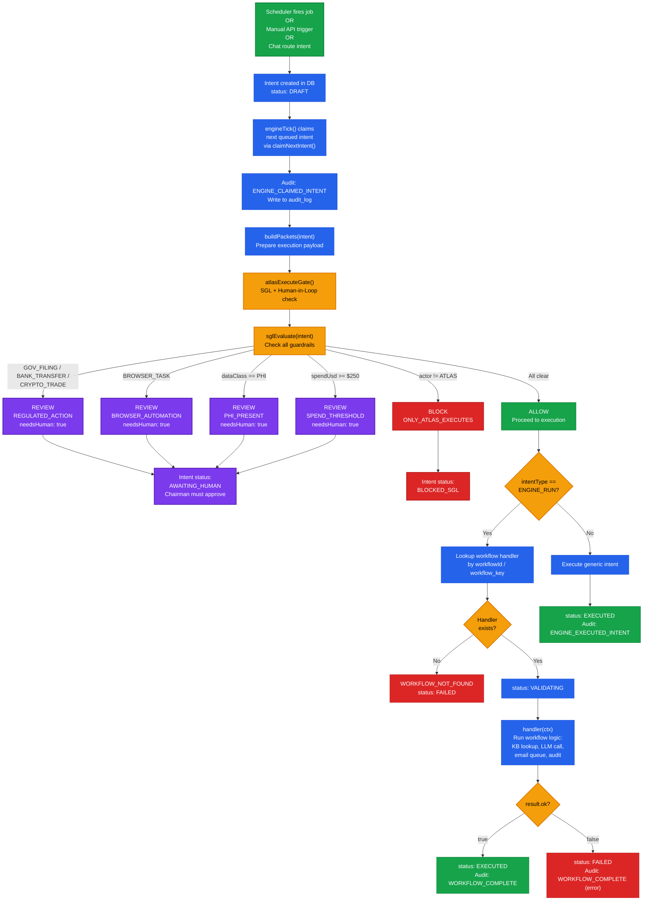

---

## 5. SGL Gate Check Detail

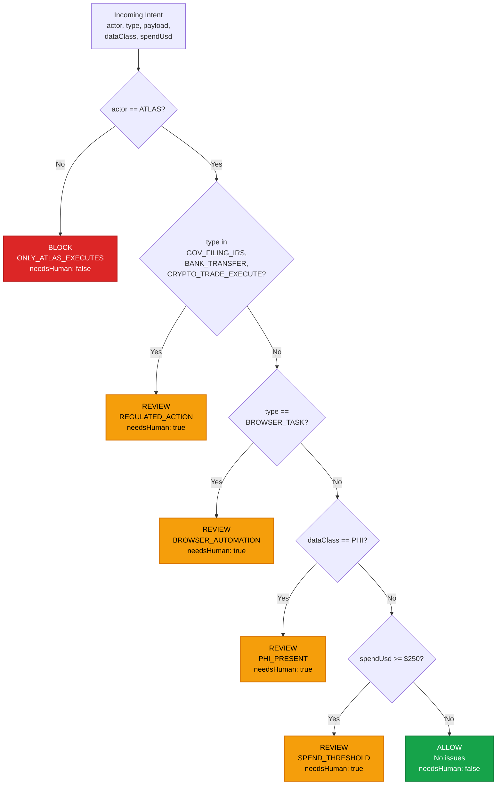

### SGL Non-Overridable Prohibitions (always BLOCK)

These are hardcoded in `policies/SGL.md` and enforced at the code level:

1. Statutory violations (federal, state, international law)
2. PHI/HIPAA unsafe handling
3. Copyright infringement
4. Trademark infringement
5. Fraudulent / deceptive claims
6. Regulated financial execution without human authorization
7. Government filings without signature
8. Unauthorized bank transfers
9. Attempts to modify SGL logic

---

## 6. Intent State Machine (Execution Constitution)

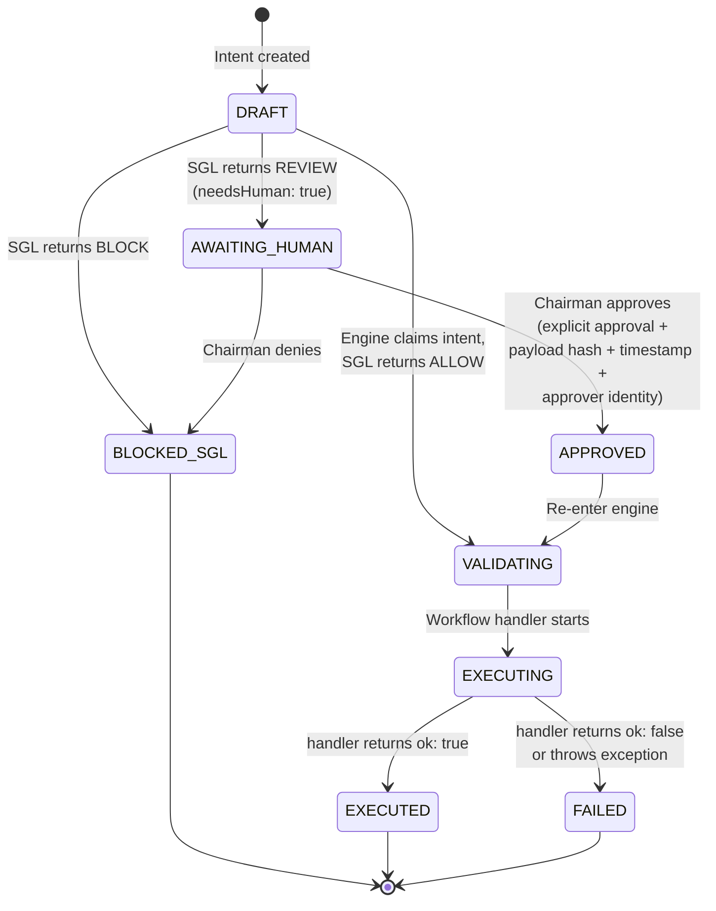

---

## 7. Daily Autonomous Schedule Flow

```mermaid
flowchart TD
    classDef phase1 fill:#f59e0b,stroke:#d97706,color:#000
    classDef phase2 fill:#dc2626,stroke:#b91c1c,color:#fff
    classDef phase3 fill:#2563eb,stroke:#1d4ed8,color:#fff
    classDef phase4 fill:#059669,stroke:#047857,color:#fff
    classDef phase5 fill:#7c3aed,stroke:#5b21b6,color:#fff

    subgraph "PHASE 1: Platform Intel Sweep (05:00-05:36 UTC)"
        direction LR
        P1_01["05:00 Kelly<br/>WF-093 X"]:::phase1
        P1_02["05:03 Fran<br/>WF-094 FB"]:::phase1
        P1_03["05:06 Dwight<br/>WF-095 Threads"]:::phase1
        P1_04["05:09 Timmy<br/>WF-096 TikTok"]:::phase1
        P1_05["05:12 Terry<br/>WF-097 Tumblr"]:::phase1
        P1_06["05:15 Cornwall<br/>WF-098 Pinterest"]:::phase1
        P1_07["05:18 Link<br/>WF-099 LinkedIn"]:::phase1
        P1_08["05:21 Emma<br/>WF-100 Alignable"]:::phase1
        P1_09["05:24 Donna<br/>WF-101 Reddit"]:::phase1
        P1_10["05:27 Reynolds<br/>WF-102 Blog SEO"]:::phase1
        P1_11["05:30 Penny<br/>WF-103 FB Ads"]:::phase1
        P1_12["05:33 Archy<br/>WF-104 Instagram"]:::phase1
        P1_13["05:36 Venny<br/>WF-105 YouTube"]:::phase1
    end

    subgraph "PHASE 2: Aggregation (05:45 UTC)"
        P2["05:45 ATLAS<br/>WF-106<br/>Read all 13 reports<br/>Generate per-agent<br/>task orders<br/>Email all agents"]:::phase2
    end

    subgraph "PHASE 3: Research & Intelligence (06:00-08:30 UTC)"
        P3_01["06:00 Binky<br/>WF-031 Research"]:::phase3
        P3_02["06:15 Venny<br/>WF-110 YT Scrape"]:::phase3
        P3_03["07:00 Daily-Intel<br/>WF-033 Brief"]:::phase3
        P3_04["07:30 Archy<br/>WF-034 Deep-Dive"]:::phase3
        P3_05["07:45 Lucy<br/>WF-112 Reception"]:::phase3
        P3_06["08:00 Claire<br/>WF-088 Calendar"]:::phase3
        P3_07["08:30 Binky<br/>WF-010 Exec Brief"]:::phase3
    end

    subgraph "PHASE 4: Social Publishing & Production (09:00-19:00 UTC)"
        P4_01["09:00 Timmy WF-054 TikTok"]:::phase4
        P4_02["09:15 Fran WF-057 Facebook"]:::phase4
        P4_03["09:30 Dwight WF-055 Threads"]:::phase4
        P4_04["10:00 Terry WF-049 Tumblr"]:::phase4
        P4_05["10:30 Kelly WF-042 X"]:::phase4
        P4_06["11:00 Link WF-045 LinkedIn"]:::phase4
        P4_07["11:30 Cornwall WF-048 Pinterest"]:::phase4
        P4_08["12:00 Donna WF-051 Reddit Mon"]:::phase4
        P4_09["14:00 Donna WF-052 Reddit Engage"]:::phase4
        P4_10["15:00 Venny WF-059 Images"]:::phase4
        P4_11["16:00 Reynolds WF-041 Blog Cross"]:::phase4
        P4_12["17:00 Penny WF-040 Multi-Plat"]:::phase4
        P4_13["18:00 Sunday WF-058 Tech Brief"]:::phase4
        P4_14["19:00 Victor WF-089 Video"]:::phase4
    end

    subgraph "PHASE 5: Closeout (22:00-23:00 UTC)"
        P5_01["22:00 Lucy<br/>WF-117 EOD Summary"]:::phase5
        P5_02["23:00 Atlas<br/>WF-119 Memory Log"]:::phase5
    end

    P1_13 --> P2
    P2 --> P3_01
    P3_07 --> P4_01
    P4_14 --> P5_01
```

---

## 8. Escalation Paths

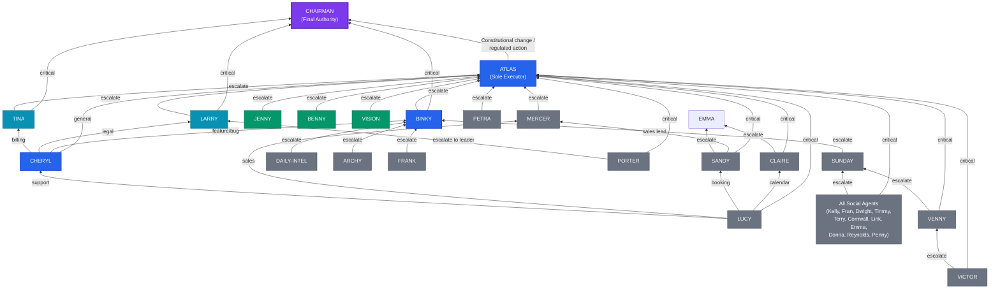

---

## 9. Approve / Deny / HIL Decision Flows

### 9a. WF-107 Tool Discovery Approve/Deny Flow

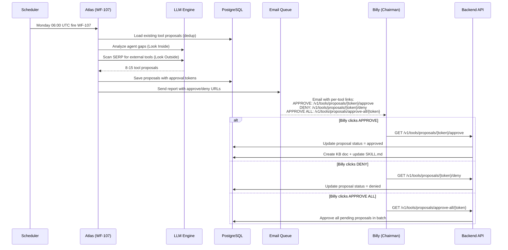

### 9b. WF-130/131 Browser Task HIL Flow

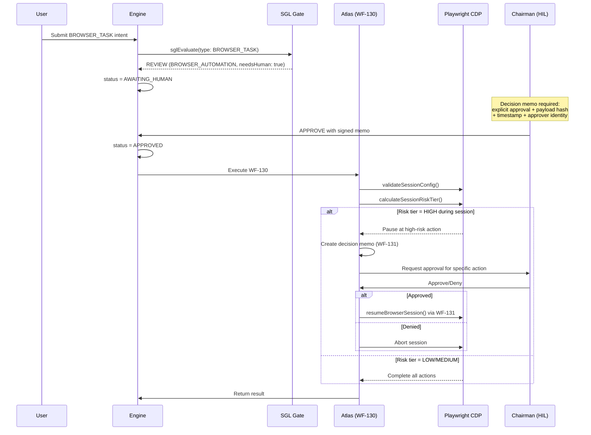

### 9c. Support Intake & Escalation Flow (WF-001 / WF-002)

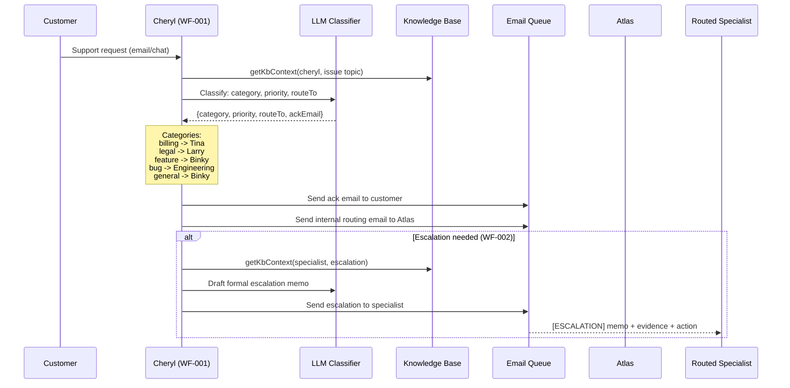

### 9d. Regulated Action HIL Flow (Spend >= $250, PHI, Gov Filing)

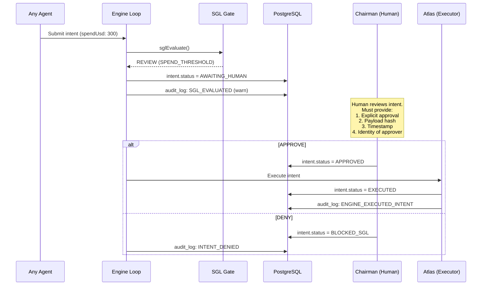

---

## 10. Email Reporting Flow (All agents report upward)

```mermaid
flowchart TD
    classDef atlas fill:#2563eb,stroke:#1d4ed8,color:#fff,stroke-width:2px
    classDef hub fill:#f59e0b,stroke:#d97706,color:#000,stroke-width:2px
    classDef agent fill:#6b7280,stroke:#4b5563,color:#fff

    ATLAS_MAILBOX["Atlas CEO Mailbox<br/>atlas.ceo@deadapp.info<br/>(Primary recipient of ALL reports)"]:::atlas

    BILLY_MAILBOX["Billy (Owner) Mailbox<br/>billy@deadapp.info<br/>(CC on critical reports)"]:::atlas

    HUB["DAILY-INTEL Hub Mailbox<br/>(CC on all intel reports)"]:::hub

    subgraph "Email Reporting Rules"
        direction TB
        R1["1. ALL reports go TO Atlas mailbox"]
        R2["2. If agent's leader != Atlas,<br/>leader is CC'd"]
        R3["3. DAILY-INTEL hub CC'd on<br/>all platform intel + briefs"]
        R4["4. Billy CC'd on tool proposals,<br/>blog posts, task orders"]
    end

    subgraph "Platform Intel (13 agents)"
        KELLY_R["Kelly WF-093"]:::agent
        FRAN_R["Fran WF-094"]:::agent
        DWIGHT_R["Dwight WF-095"]:::agent
        TIMMY_R["Timmy WF-096"]:::agent
        TERRY_R["Terry WF-097"]:::agent
        CORNWALL_R["Cornwall WF-098"]:::agent
        LINK_R["Link WF-099"]:::agent
        EMMA_R["Emma WF-100"]:::agent
        DONNA_R["Donna WF-101"]:::agent
        REYNOLDS_R["Reynolds WF-102"]:::agent
        PENNY_R["Penny WF-103"]:::agent
        ARCHY_R["Archy WF-104"]:::agent
        VENNY_R["Venny WF-105"]:::agent
    end

    KELLY_R --> ATLAS_MAILBOX
    KELLY_R -.->|"CC leader"| SUNDAY_MB["Sunday mailbox"]
    FRAN_R --> ATLAS_MAILBOX
    FRAN_R -.-> SUNDAY_MB
    DWIGHT_R --> ATLAS_MAILBOX
    TIMMY_R --> ATLAS_MAILBOX
    TERRY_R --> ATLAS_MAILBOX
    CORNWALL_R --> ATLAS_MAILBOX
    LINK_R --> ATLAS_MAILBOX
    EMMA_R --> ATLAS_MAILBOX
    DONNA_R --> ATLAS_MAILBOX
    REYNOLDS_R --> ATLAS_MAILBOX
    PENNY_R --> ATLAS_MAILBOX
    ARCHY_R --> ATLAS_MAILBOX
    ARCHY_R -.->|"CC leader"| BINKY_MB["Binky mailbox"]
    VENNY_R --> ATLAS_MAILBOX

    KELLY_R -.-> HUB
    FRAN_R -.-> HUB
    DWIGHT_R -.-> HUB
    TIMMY_R -.-> HUB
    TERRY_R -.-> HUB
    CORNWALL_R -.-> HUB
    LINK_R -.-> HUB
    EMMA_R -.-> HUB
    DONNA_R -.-> HUB
    REYNOLDS_R -.-> HUB
    PENNY_R -.-> HUB
    ARCHY_R -.-> HUB
    VENNY_R -.-> HUB

    ATLAS_AGG["Atlas WF-106<br/>Task Orders"]:::atlas
    ATLAS_AGG --> ATLAS_MAILBOX
    ATLAS_AGG --> BILLY_MAILBOX
    ATLAS_AGG -->|"Individual task emails"| ALL_AGENTS["All agent mailboxes"]
    ATLAS_AGG -.-> HUB
```

---

## 11. Execution Constitution Rules (Summary)

| Rule | Enforcement |
|------|-------------|
| **Single Executor** | Only Atlas executes. All other agents are advisory. `sglEvaluate()` blocks non-ATLAS actors. |
| **Pre-Execution** | Intent validated, SGL must return ALLOW, human approval if flagged. |
| **Human Authorization** | Required for: regulated actions, browser tasks, PHI data, spend >= $250. Must include explicit approval, payload hash, timestamp, approver identity. |
| **State Transitions** | All changes emit audit events. Valid states: DRAFT, VALIDATING, BLOCKED_SGL, REVIEW_REQUIRED, AWAITING_HUMAN, APPROVED, EXECUTING, EXECUTED, FAILED. |
| **External Side Effects** | Only Atlas may: call APIs, move funds, provision accounts, publish content, send outbound comms. |
| **SGL Immutability** | SGL logic is versioned; changes require code update, version increment, audit record, board acknowledgment. |
| **Tamper Detection** | Attempts to alter/bypass SGL are logged, trigger restricted execution state, require compliance review. |
| **M365 Write Gate** | All M365 writes still require Atlas approval at the engine level, even if the agent has draft permissions. |

---

## 12. Deep Agent Pipeline (deepMode agents)

Agents with `deepMode: true`: **Atlas, Binky, Tina, Larry, Cheryl, Sunday, Mercer, Petra**

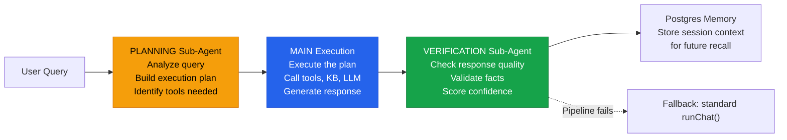

---

## 13. Weekly Schedule Overview

| Day | Time (UTC) | Agent | Workflow | Type |
|-----|-----------|-------|----------|------|
| **Monday** | 06:00 | Atlas | WF-107 | Tool Discovery & Proposal |
| **Monday** | 07:00 | Mercer | WF-063 | Acquisition Intelligence |
| **Monday** | 07:30 | Petra | WF-084 | Sprint Planning |
| **Monday** | 08:00 | Emma | WF-056 | Alignable Update |
| **Monday** | 08:30 | Sandy | WF-085 | CRM Sync |
| **Monday** | 09:00 | Porter | WF-087 | SharePoint Sync |
| **Wednesday** | 13:00 | Reynolds | WF-108 | Blog Write & Publish |
| **Friday** | 15:00 | Larry | WF-072 | Audit Gate |
| **Friday** | 15:30 | Tina | WF-073 | Finance Risk Gate |
| **Friday** | 16:00 | Frank | WF-086 | Form Aggregator |

---

## Appendix: Agent Count by Tier

| Tier | Count | Agents |
|------|-------|--------|
| **Board** | 1 | Chairman |
| **Executive** | 3 | Atlas, Binky, Cheryl |
| **Governor** | 2 | Tina, Larry |
| **Specialist** | 3 | Jenny, Benny, Vision |
| **Subagent** | 25 | Daily-Intel, Archy, Sunday, Venny, Penny, Donna, Cornwall, Link, Dwight, Reynolds, Emma, Fran, Kelly, Terry, Timmy, Mercer, Petra, Porter, Claire, Victor, Frank, Sandy, Lucy, Victor, Sandy |
| **TOTAL** | **34** | |
